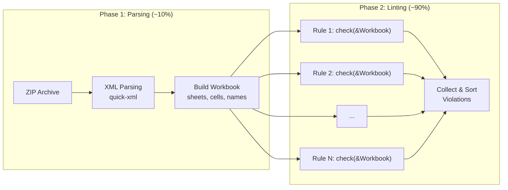

# Sheetlint Profiling & Architecture

This document captures performance profiling data and architectural insights for optimizing sheetlint.

---

## Actual Profiling Results

> **Test file**: `TC2025 2025.12.05 Motor Tributi 1402 - MY- textos sin j.xlsx` (39 MB)  
> **Workbook stats**: 51 sheets, 4,453,591 cells

### Phase Breakdown

| Phase | Time | % of Total |
|-------|------|-----------|
| **Phase 1: Parsing** (ZIP + XML → Workbook) | 5.0s | 9.6% |
| **Phase 2: Rule Execution** | 47.0s | 90.4% |
| **Total** | **52.0s** | 100% |

### Per-Rule Timing (Descending)

| Rule | Time (ms) | % of Rules | Violations | Notes |
|------|-----------|------------|------------|-------|
| **Ref306** | 12,358.6 | 26.3% | 0 | Unused sheets detection |
| **Ref303** | 11,807.3 | 25.1% | 6 | Empty sheets detection |
| **Calc202** | 7,549.0 | 16.1% | 1 | Circular references (graph + DFS) |
| **Ref305** | 5,986.7 | 12.7% | 34 | Blank rows/columns detection |
| Calc201 | 1,657.4 | 3.5% | 5,926,794 | Hardcoded values |
| Ref301 | 1,286.7 | 2.7% | 50 | Unused named ranges |
| Vul601 | 1,093.6 | 2.3% | 29,808 | Duplicate formulas |
| Cpx504 | 1,040.9 | 2.2% | 94 | Deep IF nesting |
| Vul602 | 938.5 | 2.0% | 36 | Volatile functions |
| Ref307 | 719.5 | 1.5% | 1 | Whole column/row refs |
| Cpx505 | 663.6 | 1.4% | 2,032 | Deep formula nesting |
| Data703 | 435.9 | 0.9% | 39,398 | Date formats |
| Vul603 | 367.3 | 0.8% | 196 | Empty string test |
| Err102 | 308.8 | 0.7% | 0 | Error cells |
| Vul604 | 271.4 | 0.6% | 26,014 | Error-prone functions |
| Ext802 | 267.9 | 0.6% | 0 | External workbooks |
| Ext803 | 93.4 | 0.2% | 897 | Web URLs |
| Data702 | 61.7 | 0.1% | 49 | Numeric formats |
| Ref304 | 53.7 | 0.1% | 12 | Large used range |
| Cpx509 | 27.3 | 0.1% | 490 | Long formulas |
| Data704 | 21.2 | 0.0% | 502 | Long text |
| Other (30 rules) | <1.0 | <0.1% | — | Negligible |

### Top 4 Rules = 80% of Time

```
Ref306 (Unused sheets)    ██████████████████████████░░░░░░ 26.3%
Ref303 (Empty sheets)     █████████████████████████░░░░░░░ 25.1%
Calc202 (Circular refs)   ████████████████░░░░░░░░░░░░░░░░ 16.1%
Ref305 (Blank rows/cols)  ████████████░░░░░░░░░░░░░░░░░░░░ 12.7%
                          ─────────────────────────────────
                          Combined: 80.2% of rule time
```

## Current Architecture

### Two-Phase Execution Model



### Rule Traversal Patterns

| Pattern | Rules | Data Access | Cost |
|---------|-------|-------------|------|
| **Full graph construction** | Calc202 | All formulas → build dependency graph | O(cells × refs) |
| **Full workbook iteration** | Ref303, Ref305, Ref306 | All sheets × all cells | O(sheets × cells) |
| **Per-sheet iteration** | Cpx502, Hid904 | Each sheet independently | O(sheets × cells/sheet) |
| **Formula analysis** | Calc201, Vul602, Cpx504/505 | Formula strings | O(formulas) |
| **Metadata only** | Cpx501, File1001 | Workbook-level | O(1) |
